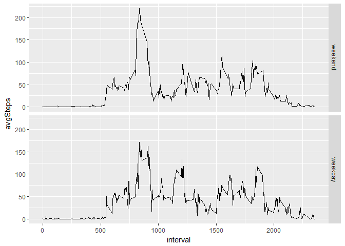

# Reproducible Research: Peer Assessment 1


## Loading and preprocessing the data


```r
unzip(zipfile = 'activity.zip')
mydata<-read.csv('activity.csv', as.is = TRUE)

#mydata$date2 <- strptime(x = mydata$date, format = "%Y-%m-%d")
mydata$date2 <- as.Date(x = mydata$date, format = "%Y-%m-%d")
#xpto<-mydata[(is.na(mydata$date2)),]

mydata$date2 <- as.POSIXct(mydata$date2 )
mydata$wday <- as.factor(weekdays(mydata$date2))
mydata$bday <- mydata$wday == "Sunday" | mydata$wday == "Saturday"
```


## What is mean total number of steps taken per day?

```r
mydata_byday <- group_by(mydata, date2) %>% 
    summarise(totalSteps = sum(steps, na.rm=TRUE))

with(mydata_byday, hist(totalSteps))
```

<!-- -->

Mean and median total number of steps taken
per day

```r
mean(mydata_byday$totalSteps)
```

```
## [1] 9354.23
```
Median total number of steps taken
per day

```r
median(mydata_byday$totalSteps)
```

```
## [1] 10395
```


## What is the average daily activity pattern?
1. Make a time series plot (i.e. type = "l") of the 5-minute interval (x-axis)
and the average number of steps taken, averaged across all days (y-axis)

```r
mydata_byinterval <- group_by(mydata, interval) %>% summarise(
    avgSteps = mean(steps, na.rm=TRUE)
)
with(mydata_byinterval, plot(x=interval, y=avgSteps, type='l') )
```

<!-- -->


2. Which 5-minute interval, on average across all the days in the dataset,
contains the maximum number of steps?

```r
mydata_byinterval[which.max(mydata_byinterval$avgSteps),]
```

```
## # A tibble: 1 × 2
##   interval avgSteps
##      <int>    <dbl>
## 1      835 206.1698
```


## Imputing missing values
1. Calculate and report the total number of missing values in the dataset
(i.e. the total number of rows with NAs)

```r
sum(is.na(mydata$steps))
```

```
## [1] 2304
```


2. Devise a strategy for filling in all of the missing values in the dataset. The
strategy does not need to be sophisticated. For example, you could use
the mean/median for that day, or the mean for that 5-minute interval, etc.

```r
impute.mean <- function(x) replace(x, is.na(x), mean(x, na.rm = TRUE))
```


3. Create a new dataset that is equal to the original dataset but with the
missing data filled in.

```r
mydata2<-mydata %>%
    group_by(interval) %>%
    mutate(
        steps2 = impute.mean(steps)
    )
```

Checking if there is no NAs left

```r
sum(is.na(mydata2$steps2))
```

```
## [1] 0
```
4. Make a histogram of the total number of steps taken each day and Calculate
and report the mean and median total number of steps taken per day. Do
these values differ from the estimates from the first part of the assignment?
What is the impact of imputing missing data on the estimates of the total
daily number of steps?


```r
mydata3 <- group_by(mydata2, date2) %>% summarise(totalSteps = sum(steps2, na.rm=TRUE))
hist(mydata3$totalSteps)
```

<!-- -->

```r
mean(mydata3$totalSteps)
```

```
## [1] 10766.19
```

```r
median(mydata3$totalSteps)
```

```
## [1] 10766.19
```


## Are there differences in activity patterns between weekdays and weekends?

1. Create a new factor variable in the dataset with two levels – “weekday”
and “weekend” indicating whether a given date is a weekday or weekend
day.


```r
mydata2$bday2 <- factor(
    mydata2$bday, 
    levels=c(FALSE, TRUE), 
    labels=c('weekend', 'weekday') 
)
```


```r
mydata3_byinterval <- group_by(mydata2, interval, bday2) %>% summarise(
    avgSteps = mean(steps2, na.rm=TRUE)
)
qplot(interval, avgSteps, data=mydata3_byinterval, facets = bday2~.,geom = "line")
```

<!-- -->


